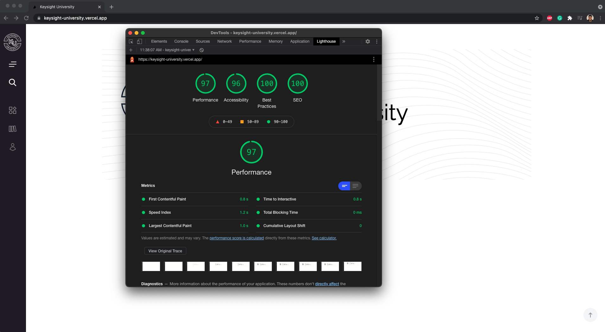

# Assignment notes

Thanks for reviewing my assignment. It was extremely fun doing it, and here are some notes to keep in mind when reviewing the files:

`hosted on`:

- https://keysight-university.vercel.app/

`/utils`

- Contains an animation file for some gsap scroll animations that I implement throughout the project

`/styles`

- Includes global styling and a base and utils folder with breakpoints, typography and color rules

`/sections`

- This folder contains each section that you can find on the page. Within each section I utilize multiple components

`/public`

- The public file includes assets such as imagery and icons

`/layout`

- Enforced layout that is utilized for the entire application.

`/components`

- Compartmentalized components

### My approach

While it was intrinsically challenging to really compartmentalize every component, since they all had distinct differences, I decided to take the following approach

1. Prior to installing everything, I made sure to review the design file for potential components. The latter was done by drawing red borders around components and writing down the amount of components that can be built from that design. This was challening, because some components looked similar yet extremely different in sizes and inner positioning.

2. After noting a list of components, I installed Nextjs with 2 dependencies: GSAP and node-sass to ensure animation and sass abilities.

3. Before building out everything, I made sure to create at least 2 to 3 components and see how I can modify them to create different looking components. An example of a pretty "complex" component is the Card component which has pretty cool possibilities.

4. After developing some components, I extracted some general styling rules and placed them in my styles, utils and base folders for global enforced styling rules.

5. Section development, for each section I made sure to write out the entire code first before compartmentalizing pieces out of each sections into separate components

6. Then I went ahead and ensured responsiveness across different devices

7. Last but not least, to make everything nice and clean I utilized next's Image component, and made sure to review everything to achieve a green score on Lighthouse (webp files, alt labels, set up proper hierarchy, etc)

8. Finally, I wanted to pimp the site up a little bit by adding some gsap animations

## Results



)

## Challenges

- Spacing, I understand that spacing is something I'm still struggling with, but I'm looking to improve on this part.
- Masonry layout. I noticed right away that the design contained 2 masonry layouts. This was pretty difficult to achieve, but I'm happy with the results.
- The card component. There were so many card components with each having just a "little" twist that still managed to make it difficult to compartmentalize and abstract it. I decided to still create separate components for it, which ended up being beneficial in terms of readability.

# Nextjs development set up

This is a [Next.js](https://nextjs.org/) project bootstrapped with [`create-next-app`](https://github.com/vercel/next.js/tree/canary/packages/create-next-app).

## Getting Started

First, run the development server:

```bash
npm run dev
# or
yarn dev
```

Open [http://localhost:3000](http://localhost:3000) with your browser to see the result.

You can start editing the page by modifying `pages/index.js`. The page auto-updates as you edit the file.

[API routes](https://nextjs.org/docs/api-routes/introduction) can be accessed on [http://localhost:3000/api/hello](http://localhost:3000/api/hello). This endpoint can be edited in `pages/api/hello.js`.

The `pages/api` directory is mapped to `/api/*`. Files in this directory are treated as [API routes](https://nextjs.org/docs/api-routes/introduction) instead of React pages.

## Learn More

To learn more about Next.js, take a look at the following resources:

- [Next.js Documentation](https://nextjs.org/docs) - learn about Next.js features and API.
- [Learn Next.js](https://nextjs.org/learn) - an interactive Next.js tutorial.

You can check out [the Next.js GitHub repository](https://github.com/vercel/next.js/) - your feedback and contributions are welcome!

## Deploy on Vercel

The easiest way to deploy your Next.js app is to use the [Vercel Platform](https://vercel.com/new?utm_medium=default-template&filter=next.js&utm_source=create-next-app&utm_campaign=create-next-app-readme) from the creators of Next.js.

Check out our [Next.js deployment documentation](https://nextjs.org/docs/deployment) for more details.
